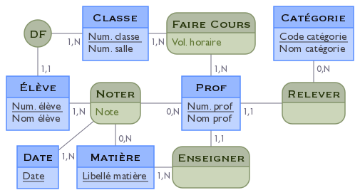
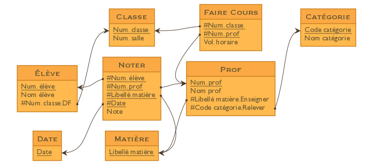

Mocodo est un logiciel d'aide à l'enseignement et à la conception des [bases de données relationnelles](https://fr.wikipedia.org/wiki/Base_de_données_relationnelle).

- En entrée, il prend une description textuelle des entités et associations du modèle conceptuel de données ([MCD](https://fr.wikipedia.org/wiki/Modèle_entité-association)).
- En sortie, il produit son diagramme entité-association en [SVG](https://fr.wikipedia.org/wiki/Scalable_Vector_Graphics) et son schéma relationnel ([MLD](https://fr.wikipedia.org/wiki/Merise_&amp;# 40;informatique&amp;# 41;#Le_MLD_mod.C3.A8le_logique_des_donn.C3.A9es)) en [SQL](https://fr.wikipedia.org/wiki/Structured_Query_Language), [$\mathrm\LaTeX$](https://fr.wikipedia.org/wiki/LaTeX), [Markdown](https://fr.wikipedia.org/wiki/Markdown), etc.

Ci-dessous, un exemple d'appel du programme (première ligne) sur un texte d'entrée (lignes suivantes), puis, en sortie, le MCD et le MLD correspondants:

    %%mocodo --mld --colors ocean --shapes copperplate --relations diagram markdown_data_dict
    DF, 11 Élève, 1N Classe
    Classe: Num. classe, Num. salle
    Faire Cours, 1N Classe, 1N Prof: Vol. horaire
    Catégorie: Code catégorie, Nom catégorie
    
    Élève: Num. élève, Nom élève
    Noter, 1N Élève, 0N Prof, 0N Matière, 1N Date: Note
    Prof: Num. prof, Nom prof
    Relever, 0N Catégorie, 11 Prof
    
    Date: Date
    Matière: Libellé matière
    Enseigner, 11 Prof, 1N Matière

**Classe** (<u>Num. classe</u>, Num. salle)  
**Faire Cours** (<u>_Num. classe_</u>, <u>_Num. prof_</u>, Vol. horaire)  
**Catégorie** (<u>Code catégorie</u>, Nom catégorie)  
**Élève** (<u>Num. élève</u>, Nom élève, _Num. classe_)  
**Noter** (<u>_Num. élève_</u>, <u>_Num. prof_</u>, <u>_Libellé matière_</u>, <u>_Date_</u>, Note)  
**Prof** (<u>Num. prof</u>, Nom prof, _Libellé matière_, _Code catégorie_)  

L'appel ci-dessus a également construit le dictionnaire des données:

- Num. classe
- Num. salle
- Vol. horaire
- Code catégorie
- Nom catégorie
- Num. élève
- Nom élève
- Note
- Num. prof
- Nom prof
- Date
- Libellé matière

Ainsi que le diagramme relationnel, qui peut être visualisé par un nouvel appel:

    %mocodo --input mocodo_notebook/sandbox.mld --colors desert

La devise de Mocodo, « nickel, ni souris », en synthétise les points forts:

- description textuelle des données. L'utilisateur n'a pas à renseigner, placer et déplacer des éléments comme avec une lessive ordinaire. Il ne fournit rien de plus que les informations définissant son MCD. L'outil s'occupe tout seul du plongement;
- propreté du rendu. La sortie se fait en vectoriel, prête à être affichée, imprimée, agrandie, exportée dans une multitude de formats sans perte de qualité;
- rapidité des retouches. L'utilisateur rectifie les alignements en insérant des éléments invisibles, en dupliquant des coordonnées ou en ajustant des facteurs mutiplicatifs: là encore, il travaille sur une description textuelle, et non directement sur le dessin.

Mocodo est libre, gratuit et multiplateforme. Si vous l'aimez, faites-lui de la pub en incluant l'un de ses logos sur votre support: cela multipliera ses chances d'attirer des contributeurs qui le feront évoluer.
